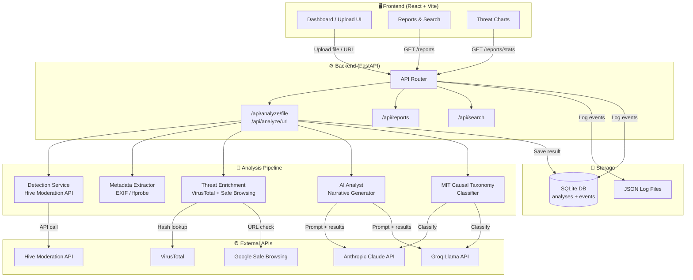

# Sentinel — System Architecture

## Overview

Sentinel is a **Deepfake & NCEI Threat Intelligence Platform** that provides structured metadata, threat scoring, and analyst narratives for synthetic media. It is designed as a modular, API-first application with a React frontend and FastAPI backend.

---

## Architecture Diagram



---

## Component Breakdown

### Frontend (React + Vite)
- **UploadZone** — Drag-and-drop or click-to-upload for images, video, audio
- **URLSubmit** — URL-based submission form
- **ThreatCard** — Verdict display with confidence ring and threat level badge
- **MetadataPanel** — Collapsible EXIF/technical metadata viewer
- **NarrativePanel** — AI-generated analyst summary
- **TaxonomyPanel** — MIT Causal Taxonomy display (Entity, Intent, Timing) with confidence bar
- **ModelSelector** — Toggle between Claude (Anthropic) and Llama 3 (Groq) for AI classification
- **Dashboard** — Aggregate stats, recent reports, threat level chart, taxonomy columns
- **ReportsTable** — Searchable/filterable history of all analyses with taxonomy data

### Backend (FastAPI)
| Route | Method | Description |
|-------|--------|-------------|
| `/api/analyze/file` | POST | Upload & analyze media file |
| `/api/analyze/url` | POST | Submit URL for analysis |
| `/api/analyze/models` | GET | List available AI models (Claude, Llama) |
| `/api/analyze/{id}` | GET | Retrieve analysis by ID |
| `/api/reports/` | GET | List all reports (paginated) |
| `/api/reports/stats` | GET | Dashboard statistics |
| `/api/reports/{id}/export` | GET | Export full report |
| `/api/search/` | GET | Full-text search across analyses |
| `/health` | GET | Health check |

### Services
| Service | Purpose | External Dependency |
|---------|---------|-------------------|
| `detection.py` | Deepfake scoring | Hive Moderation API |
| `metadata.py` | Technical forensics | PIL, mutagen, ffprobe |
| `enrichment.py` | Threat intel | VirusTotal, Google Safe Browsing |
| `routers/analyze.py` | Orchestration + narrative + taxonomy | Anthropic Claude / Groq Llama |

---

## Data Flow

```
User uploads file
    ↓
FastAPI validates type & size
    ↓
SHA-256 hash computed (no PII stored)
    ↓
[Parallel] Detection API → confidence score
[Parallel] Metadata extraction → EXIF/dims/format
    ↓
Enrichment (hash lookup, URL reputation)
    ↓
AI generates analyst narrative (Claude or Llama)
    ↓
MIT Causal Taxonomy classification (Entity, Intent, Timing)
    ↓
Result saved to SQLite (async, includes taxonomy fields)
    ↓
JSON response returned to client
    ↓
UI renders ThreatCard + Metadata + Narrative + TaxonomyPanel
```

---

## Security Boundaries

- Files are **never persisted to disk** — processed in memory only
- File **SHA-256 hash** stored, never filename or file contents
- **EXIF GPS and device serial stripped** before storage
- All external API calls are **non-blocking** with timeouts
- Rate limiting enforced at middleware layer

---

## Deployment Topology

```
[User Browser]
      ↓ HTTPS
[Vercel / Netlify]   ← React Frontend (static)
      ↓ HTTPS API calls
[Railway / Render]   ← FastAPI Backend
      ↓
[SQLite / Postgres]  ← Persistent storage
```
